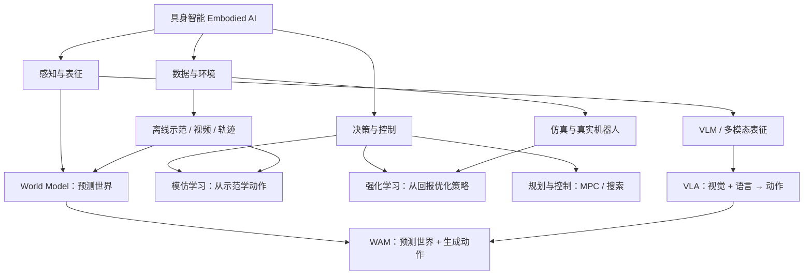

# Embodied AI Starter Map｜具身智能入门地图

一个面向初学者的、可执行的具身智能学习仓库：用知识图谱串起 **VLA、World Model（WM）、World Action Model（WAM）、模仿学习（IL）与强化学习（RL）**，并给出论文、代码、基准与实践路线。

> 目标不是收集尽可能多的链接，而是回答三个问题：**概念之间是什么关系？先学什么？下一步跑什么？**

## 快速入口

| 你想做什么 | 从这里开始 |
| --- | --- |
| 先建立全局概念 | [知识图谱](docs/knowledge-map.md) |
| 按顺序读论文 | [论文清单](docs/papers.md) |
| 找官方代码和基准 | [代码仓与工具](docs/codebases.md) |
| 制定学习计划 | [8 周学习路线](docs/roadmap.md) |
| 查缩写和术语 | [术语表](docs/glossary.md) |

## 一张图看懂主线



最重要的三条区分：

1. **VLA** 通常直接学习从视觉与语言到动作的策略；**WM** 重点学习环境如何演化；**WAM** 将“预测未来”和“生成动作”耦合起来。
2. **offline / online** 描述数据是否在训练时继续与环境交互；**model-free / model-based** 描述决策时是否显式学习并利用环境模型。这是两条正交轴，不是三个互斥类别。
3. **预训练、模仿学习和 RL** 可以组成一条流水线：大规模多模态/机器人数据预训练 → 示范微调 → 仿真或真实环境在线 RL 后训练。

## 指定必看资源

### 论文

- **π0.5: A Vision-Language-Action Model with Open-World Generalization** — [论文](https://arxiv.org/abs/2504.16054) · [官方介绍](https://www.pi.website/blog/pi05) · [OpenPI](https://github.com/Physical-Intelligence/openpi)  
  关注异构数据协同训练、跨机器人迁移、高层语义子任务与长时程泛化。
- **Fast-WAM: Do World Action Models Need Test-time Future Imagination?** — [论文](https://arxiv.org/abs/2603.16666) · [项目页](https://yuantianyuan01.github.io/FastWAM/) · [代码](https://github.com/yuantianyuan01/FastWAM)  
  关注视频协同训练与测试时未来生成的解耦，以及 WAM 的推理效率。

### 代码仓

- **StarVLA** — [GitHub](https://github.com/starVLA/starVLA) · [文档/项目页](https://starvla.github.io/) · [论文](https://arxiv.org/abs/2604.05014)  
  模块化 VLA 研究平台，适合理解 VLM backbone、action head、训练和评测如何拼装。
- **RLinf** — [GitHub](https://github.com/RLinf/RLinf) · [文档](https://rlinf.readthedocs.io/) · [论文](https://arxiv.org/abs/2509.15965)  
  面向具身与智能体基础模型的可扩展 RL 后训练基础设施；可直接查看 [StarVLA + RLinf](https://rlinf.readthedocs.io/en/latest/rst_source/examples/embodied/starvla.html) 示例。

完整扩展清单见 [论文清单](docs/papers.md) 和 [代码仓与工具](docs/codebases.md)。

## 推荐的最小实践闭环


建议最终产出一张可比较的实验表：任务成功率、环境步数、示范数量、训练 GPU 时、推理延迟、是否显式预测未来、是否使用在线交互。

## 仓库结构

```text
.
├── README.md
├── docs/
│   ├── knowledge-map.md   # 概念关系与 RL 二维分类
│   ├── papers.md          # 分级论文阅读清单
│   ├── codebases.md       # 官方代码、仿真器、数据与基准
│   ├── roadmap.md         # 8 周路线与阶段产出
│   └── glossary.md        # 中英术语表
├── .github/
│   ├── ISSUE_TEMPLATE/resource.yml
│   ├── pull_request_template.md
│   └── workflows/link-check.yml
├── CONTRIBUTING.md
└── LICENSE
```

## 使用方式

1. 先读 [知识图谱](docs/knowledge-map.md)，明确 VLA、WM、WAM、IL、RL 的边界。
2. 按 [论文清单](docs/papers.md) 中的 `S0 → S1 → S2` 顺序阅读，不必逐篇精读。
3. 从 [代码仓与工具](docs/codebases.md) 选一个数据/训练框架和一个基准，完成最小闭环。
4. 用 [8 周学习路线](docs/roadmap.md) 记录周产出，而不是只记录阅读数量。

解压后发布到自己的 GitHub 仓库：

```bash
git init
git add .
git commit -m "docs: create embodied AI starter map"
git branch -M main
git remote add origin https://github.com/<YOUR_NAME>/<YOUR_REPO>.git
git push -u origin main
```

## 范围与约定

- 当前重点：机器人操作、通用 VLA、World Model / WAM、RL 后训练。
- 暂不展开：纯导航、自动驾驶、传统 SLAM、底层电机与机械设计。
- “推荐”表示适合当前学习目标，不等于通用排行榜。
- 论文和第三方仓库各自遵循原作者的许可证；本仓库只提供学习导航与原创笔记框架。

资源有遗漏或链接失效？请按 [贡献指南](CONTRIBUTING.md) 提交 Issue 或 PR。
