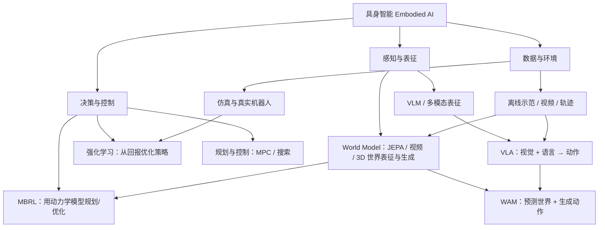
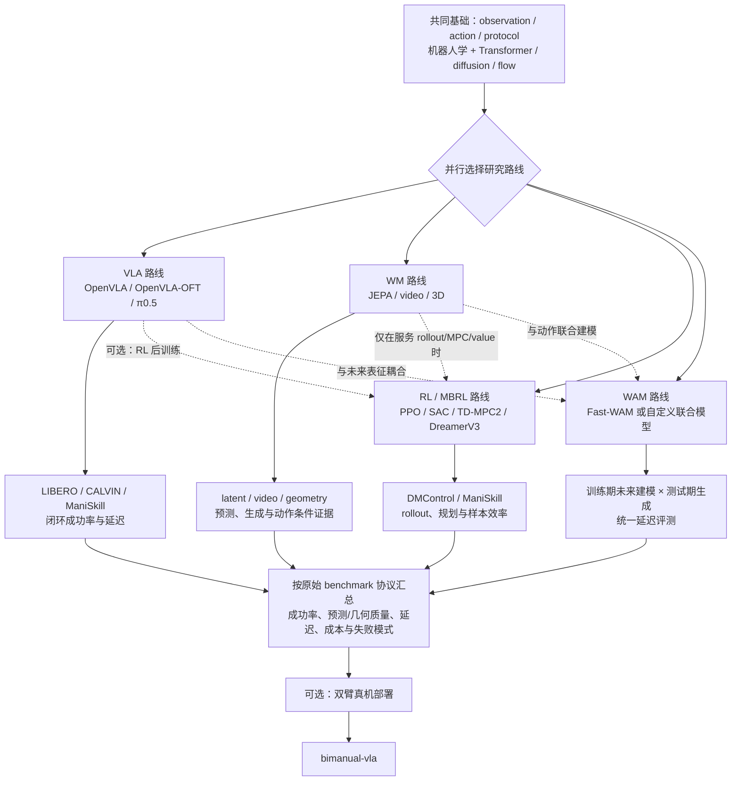

# Embodied AI Starter Map｜具身智能入门地图

一个面向初学者的具身智能学习仓库： **VLA、World Model（WM）、Model-based RL（MBRL）、World Action Model（WAM）与强化学习（RL）**，并给出论文、代码、benchmark 与实践路线。

有任何问题可以询问AI工具帮助学习

## 快速入口

| 方向                                     | 从这里开始                        |
| ---------------------------------------- | --------------------------------- |
| 先建立全局概念                           | [知识图谱](docs/knowledge-map.md)    |
| 补齐机器人学基础                         | [机器人学知识](docs/robotics.md)     |
| 学 Transformer、Diffusion、Flow Matching | [模型基础](docs/model-basics.md)     |
| 按顺序读论文                             | [论文清单](docs/papers.md)           |
| 找官方代码和基准                         | [代码仓与工具](docs/codebases.md)    |
| 按任务选择 benchmark                     | [Benchmark 指南](docs/benchmarks.md) |
| 制定学习计划                             | [章节式学习路线](docs/roadmap.md)    |
| 查缩写和术语                             | [术语表](docs/glossary.md)           |

## 一张图看懂主线



最重要的三条区分：

1. **VLA** 通常直接学习从视觉与语言到动作的策略；**WM** 可以学习潜在状态、未来视频、3D/4D 场景或动作条件的环境演化；**WAM** 将未来世界表征与动作生成耦合起来。
2. **MBRL** 是用学习到的动力学/奖励模型做规划、价值估计或策略优化的 RL 路线；它可以使用 latent WM，但不等于 JEPA、视频生成或 3D 生成。反过来，WM 也可以只做表征/预测而不直接训练控制策略。
3. **offline / online** 描述数据是否在训练时继续与环境交互；**model-free / model-based** 描述决策时是否显式使用动力学模型。这是两条正交轴，不是三个互斥类别。
4. **预训练、动作监督微调、WM 预训练和 RL/MBRL 后训练** 可以按研究问题组合。

## 相关资源

### 模型基础

[模型基础](docs/model-basics.md)：Transformer 如何处理 `[B,L,D]` 序列，diffusion 如何对 `[B,H,A]` 动作块加噪/去噪，flow matching 如何学习速度场并用 ODE 生成动作，以及这些 head 如何接入 VLA、WM、WAM。相关论文和代码入口如下：

|                         | 论文                                                                                                         | 代码/实现                                                                                                                           | 学习重点                                                    |
| ----------------------- | ------------------------------------------------------------------------------------------------------------ | ----------------------------------------------------------------------------------------------------------------------------------- | ----------------------------------------------------------- |
| Transformer             | [Attention Is All You Need](https://arxiv.org/abs/1706.03762)                                                   | [Hugging Face Transformers](https://github.com/huggingface/transformers)                                                               | token、Q/K/V、mask、`[B,L,D]` 与 next-token head          |
| Diffusion               | [DDPM](https://arxiv.org/abs/2006.11239)、[Diffusion Policy](https://arxiv.org/abs/2303.04137)                     | [Hugging Face Diffusers](https://github.com/huggingface/diffusers)、[Diffusion Policy](https://github.com/real-stanford/diffusion_policy) | noise schedule、epsilon/x0/v 目标、action chunk 与反向采样  |
| Flow Matching           | [Flow Matching for Generative Modeling](https://arxiv.org/abs/2210.02747)、[π0](https://arxiv.org/abs/2410.24164) | [Flow Matching](https://github.com/facebookresearch/flow_matching)、[OpenPI](https://github.com/Physical-Intelligence/openpi)             | velocity field、probability path、ODE solver 与连续动作生成 |
| DiT / 视频生成 backbone | [Scalable Diffusion Models with Transformers](https://arxiv.org/abs/2212.09748)                                 | [DiT](https://github.com/facebookresearch/DiT)                                                                                         | Transformer 作为 WM/视频扩散生成器的实现方式                |

### 机器人学基础

模型和策略负责提出任务级的状态、未来或动作意图，机器人学与控制层负责坐标变换、IK、轨迹插值、阻抗/力控、碰撞与急停。开始跑模型前，先阅读 [机器人学基础](docs/robotics.md)，确认 observation、action、frame、单位和控制频率。

### 论文主线

| 方向                  | 先读                                                                                                                                                                         | 重点问题                                             |
| --------------------- | ---------------------------------------------------------------------------------------------------------------------------------------------------------------------------- | ---------------------------------------------------- |
| VLA                   | [OpenVLA](https://arxiv.org/abs/2406.09246)、[OpenVLA-OFT](https://arxiv.org/abs/2501.19645)、[π0.5](https://arxiv.org/abs/2504.16054)                                               | 动作接口、推理效率、跨任务/本体数据与开放世界泛化    |
| WM：JEPA / video / 3D | [V-JEPA 2](https://arxiv.org/abs/2506.09985)、[Genie](https://arxiv.org/abs/2402.15391)、[VGGT](https://arxiv.org/abs/2503.11651)                                                     | 自监督未来表征、可交互视频和 3D 几何/场景建模        |
| MBRL                  | [World Models](https://arxiv.org/abs/1803.10122)、[PlaNet](https://arxiv.org/abs/1811.04551)、[DreamerV3](https://arxiv.org/abs/2301.04104)、[TD-MPC2](https://arxiv.org/abs/2310.16828) | 学习动力学后做 imagined rollout、规划或价值/策略优化 |
| WAM                   | [World Action Models survey](https://arxiv.org/abs/2605.12090)、[Fast-WAM](https://arxiv.org/abs/2603.16666)                                                                       | 未来世界与动作的耦合，以及测试时未来生成成本         |
| RL                    | [PPO](https://arxiv.org/abs/1707.06347)、[SAC](https://arxiv.org/abs/1801.01290)、[CQL](https://arxiv.org/abs/2006.04779)、[IQL](https://arxiv.org/abs/2110.06169)                       | online/offline 边界、探索、保守价值与后训练          |

### 代码主线

| 方向                  | 推荐仓库                                                                                                                                                                                                                                          | 用途                                                                     |
| --------------------- | ------------------------------------------------------------------------------------------------------------------------------------------------------------------------------------------------------------------------------------------------- | ------------------------------------------------------------------------ |
| VLA                   | [OpenVLA](https://github.com/openvla/openvla)、[OpenVLA-OFT](https://github.com/moojink/openvla-oft)、[OpenPI](https://github.com/Physical-Intelligence/openpi)、[StarVLA](https://github.com/starVLA/starVLA)                                                | 开源 VLA 推理、效率优化、适配与模块拆解                                  |
| 动作策略              | [Diffusion Policy](https://github.com/real-stanford/diffusion_policy)、[ACT](https://github.com/tonyzhaozh/act)                                                                                                                                         | diffusion / action chunking 的可读实现                                   |
| WM：JEPA / video / 3D | [V-JEPA 2](https://github.com/facebookresearch/vjepa2)、[Cosmos Predict2](https://github.com/nvidia-cosmos/cosmos-predict2)、[VGGT](https://github.com/facebookresearch/vggt)、[3D Gaussian Splatting](https://github.com/graphdeco-inria/gaussian-splatting) | 自监督潜在预测、视频世界建模与 3D 场景表示；是否能用于动作闭环需单独验证 |
| MBRL                  | [TD-MPC2](https://github.com/nicklashansen/tdmpc2)、[DreamerV3](https://github.com/danijar/dreamerv3)                                                                                                                                                   | 潜空间动力学、imagined rollout、MPC 与策略优化                           |
| WAM                   | [FastWAM](https://github.com/yuantianyuan01/FastWAM)                                                                                                                                                                                                 | 视频/世界表征与动作生成的耦合推理                                        |
| RL / MBRL             | [Gymnasium](https://github.com/Farama-Foundation/Gymnasium)、[Stable-Baselines3](https://github.com/DLR-RM/stable-baselines3)、[CleanRL](https://github.com/vwxyzjn/cleanrl)、[DQN Zoo](https://github.com/google-deepmind/dqn_zoo)、[d3rlpy](https://github.com/takuseno/d3rlpy)、[Implicit Q-Learning](https://github.com/ikostrikov/implicit_q_learning)、[Minari](https://github.com/Farama-Foundation/Minari)、[TD-MPC2](https://github.com/nicklashansen/tdmpc2)、[DreamerV3](https://github.com/danijar/dreamerv3) | PPO、SAC、DQN、IQL 与 MBRL 项目入口 |
| RL 后训练             | [RLinf](https://github.com/RLinf/RLinf)                                                                                                                                                                                                  | VLA 后训练基础设施                                                        |

完整论文与仓库索引见 [论文清单](docs/papers.md) 和 [代码仓与工具](docs/codebases.md)。

## 常用 benchmark

优先选择有公开任务定义、成功判定和官方评测脚本的操作 benchmark；跨方法比较时固定相机、动作空间和 rollout 协议。

| Benchmark                                                | 主要方向                | 适合回答的问题                                                | 官方入口                                                                                                     |
| -------------------------------------------------------- | ----------------------- | ------------------------------------------------------------- | ------------------------------------------------------------------------------------------------------------ |
| **LIBERO**（Spatial / Object / Goal / LIBERO-100） | VLA、语言条件操作、迁移 | 任务、物体、空间和 lifelong 组合泛化                          | [Project](https://libero-project.github.io/main.html) · [Code](https://github.com/Lifelong-Robot-Learning/LIBERO) |
| **CALVIN**                                         | VLA、长时程操作         | 语言指令链、连续任务完成与恢复                                | [Code](https://github.com/mees/calvin) · [Paper](https://arxiv.org/abs/2112.03227)                                |
| **ManiSkill**                                      | 操作 RL、VLA、数据生成  | GPU 并行采样、接触丰富任务与 sim-to-real                      | [Project](https://maniskill.ai/) · [Code](https://github.com/haosulab/ManiSkill)                                  |
| **Meta-World**                                     | 多任务操作 RL           | 多任务/组合泛化与标准化 success rate                          | [Project](https://meta-world.github.io/) · [Code](https://github.com/Farama-Foundation/Metaworld)                 |
| **RoboTwin 2.0**                                   | 双臂操作、VLA/WAM       | 数字孪生数据、跨场景与跨任务泛化                              | [Code](https://github.com/RoboTwin-Platform/RoboTwin)                                                           |
| **RoboCasa / robosuite**                           | 操作 WM/VLA             | 厨房与接触动力学中的视频/状态预测和长时程闭环                 | [RoboCasa](https://github.com/robocasa/robocasa) · [robosuite](https://github.com/ARISE-Initiative/robosuite)     |
| **DMControl / Minari**                             | MBRL、offline RL        | 连续控制的样本效率、模型偏差与数据协议                        | [DMControl](https://github.com/google-deepmind/dm_control) · [Minari](https://minari.farama.org/)                 |
| **WM 预测/生成评测**                               | JEPA、视频、3D/4D 表征  | 未来表征、视频/几何质量与动作条件一致性；通常没有一个统一总榜 | [V-JEPA 2](https://github.com/facebookresearch/vjepa2) · [VGGT](https://github.com/facebookresearch/vggt)         |

跨论文结果可用 [Embodied Meta-LLM Leaderboard](https://ppsdk.github.io/embodied-meta-leaderboard/) 做索引，但必须保留原始 benchmark、任务子集、metric、数据类型和评测协议；该页面不是把所有分数归一成一个总榜。

## 实操路线



VLA、WM 和 RL/MBRL 是并行研究路线，不要求先完成其中一条才能开始另一条：

- **VLA 路线**：以 LIBERO、CALVIN、ManiSkill 或 RoboTwin 的策略闭环为主，重点是动作接口、泛化、成功率和控制延迟。
- **WM 路线**：以 JEPA、视频和 3D/4D 表征/生成验证为主，重点是未来预测、几何质量、动作条件敏感性和下游控制证据。
- **RL/MBRL 路线**：RL 先做 PPO/SAC 等 model-free 基线，MBRL 再独立验证 dynamics/reward、imagined rollout、MPC 或 value learning；不需要先训练视频/3D WM。
- **WAM 路线**：需要同时关注未来表征与动作生成，但它是可选的交叉方向，不是所有 VLA 或 WM 项目的必经阶段。

评测字段与比较协议见 [Benchmark 指南](docs/benchmarks.md)。

## 真机部署教程

完成仿真 benchmark 和策略接口核对后，双臂真机部署使用 [SUNNYsyy2005/bimanual-vla](https://github.com/SUNNYsyy2005/bimanual-vla) 作为实践入口。部署记录至少包括机器人本体与关节/末端动作接口、相机与控制频率、动作 chunk、归一化统计、急停与安全边界，以及仿真到真机的失败案例。具体硬件、依赖和启动方式以该仓库当前 README 为准。

## 仓库结构

```text
.
├── README.md
├── docs/
│   ├── knowledge-map.md   # WM/MBRL/WAM/RL 概念关系与分类
│   ├── robotics.md        # 运动学、动力学、控制、标定与真机闭环
│   ├── model-basics.md     # Transformer、diffusion、flow matching 与 DiT 基础
│   ├── papers.md          # 分级论文阅读清单
│   ├── codebases.md       # 官方代码、仿真器、数据与基准
│   ├── benchmarks.md      # 常用 benchmark、协议与选择建议
│   ├── roadmap.md         # 章节路线与项目链接
│   └── glossary.md        # 中英术语表
├── .github/
│   ├── ISSUE_TEMPLATE/resource.yml
│   ├── pull_request_template.md
│   └── workflows/link-check.yml
├── CONTRIBUTING.md
└── LICENSE
```

## 致谢

感谢以下开源项目为本仓库的目录组织、资源导航和研究路线提供参考：

- [jiangranlv/embodied-ai-start](https://github.com/jiangranlv/embodied-ai-start)：具身智能资源整理与入门导航。
- [TianxingChen/Embodied-AI-Guide](https://github.com/TianxingChen/Embodied-AI-Guide)：具身学习方向分类与阅读线索。
- [OpenMOSS/Awesome-WAM](https://github.com/OpenMOSS/Awesome-WAM)：World Action Model 资源索引。
- [Embodied Meta-LLM Leaderboard](https://ppsdk.github.io/embodied-meta-leaderboard/)：跨论文 benchmark 和协议追踪的索引思路。

同时感谢本仓库所链接的 OpenVLA、OpenPI、StarVLA、FastWAM、RLinf、V-JEPA 2、Diffusion Policy、TD-MPC2、DreamerV3、RoboTwin、LIBERO、ManiSkill 与 [bimanual-vla](https://github.com/SUNNYsyy2005/bimanual-vla) 等项目的开源工作。各项目的代码、论文、数据和许可证归原作者及其维护者所有，本仓库仅作学习导航与交叉引用。
