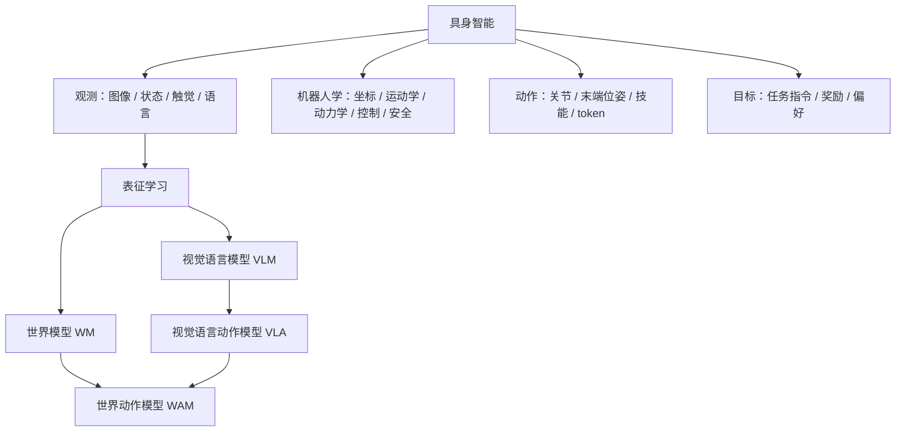
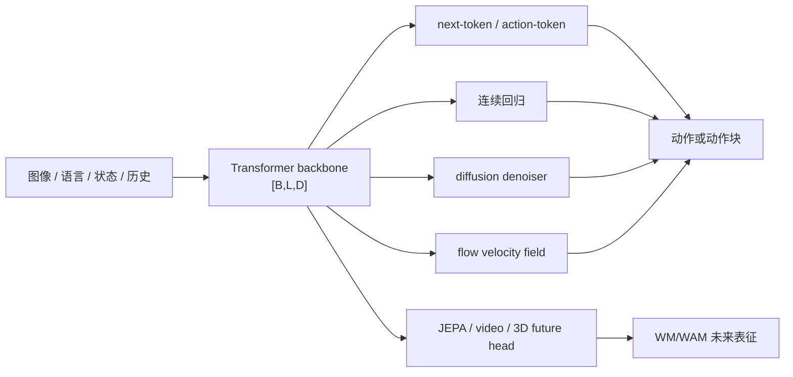
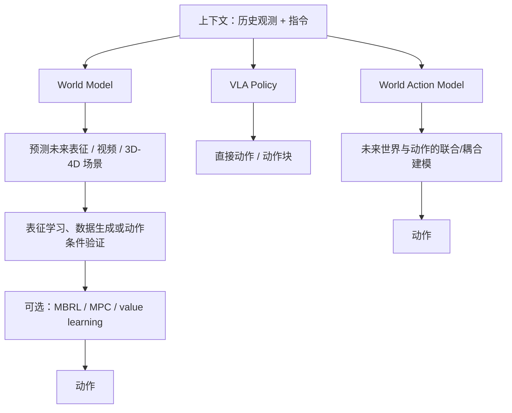
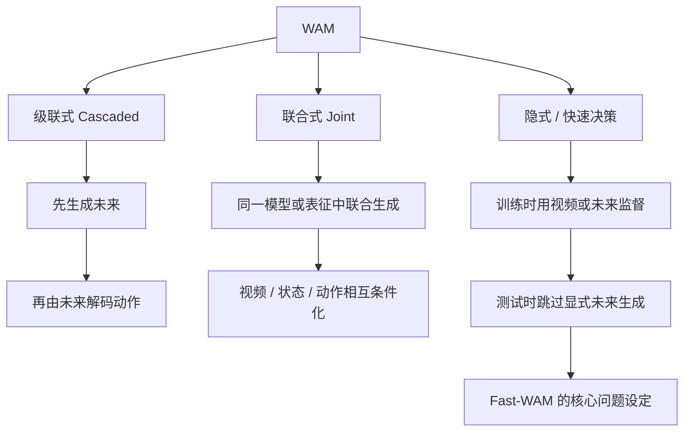
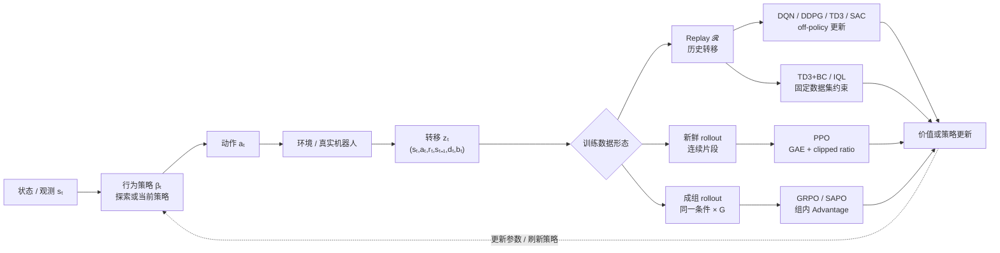
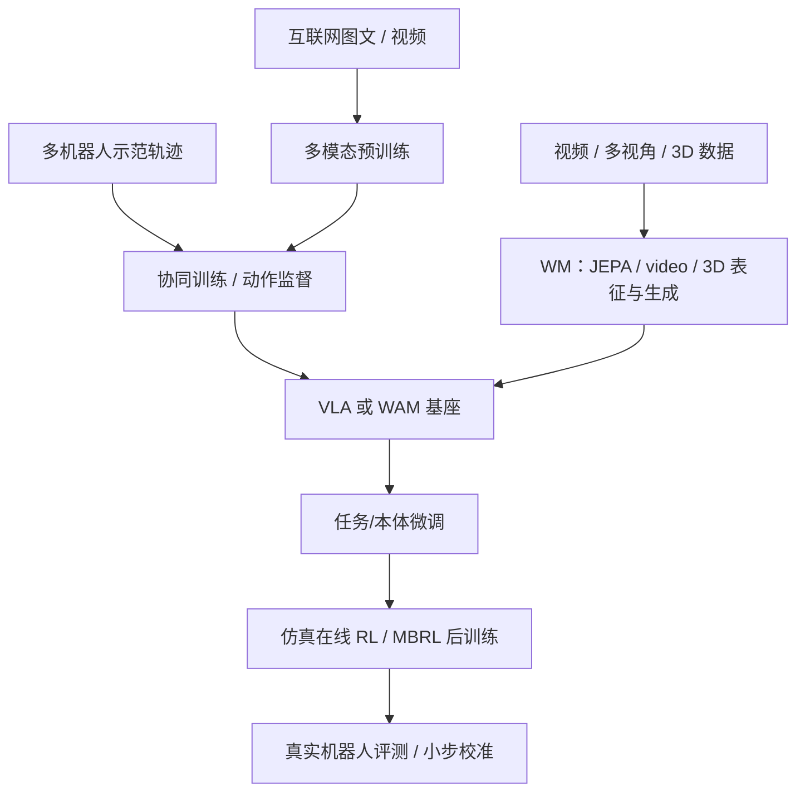

# 知识图谱：WM、MBRL、WAM 与 RL

**模型预测什么、动作从哪里来、数据如何获得、部署时是否规划？**

## 0. 机器人学基础

机器人学把模型输出接到真实执行器：坐标系与 $SE(3)$ 定义几何关系，运动学与 Jacobian 负责可达性和速度映射，动力学与控制器负责稳定执行，标定与安全层负责 sim-to-real 和急停。详见 [机器人学基础](robotics.md)。

## 0.1 仿真器与学习层

仿真器负责推进物理、场景和传感器；学习算法消费它产生的 transition。选择仿真器时要同时固定物理步长、策略步长、动作保持（decimation）、资产版本和并行环境数。

~~~mermaid
flowchart LR
    MUJOCO[MuJoCo\n轻量动力学 / 控制原型] --> TRANS[transition\n观测、动作、奖励、终止]
    ISAAC[Isaac Sim\nUSD / PhysX / 传感器 / GPU] --> TRANS
TRANS --> RL[强化学习：PPO / SAC / DQN]
TRANS --> MBRL[MBRL：动力学 / 展望 / MPC]
    ISAAC --> LAB[Isaac Lab\n并行环境与机器人学习层]
    LAB --> RL
~~~

仿真教程：[MuJoCo 仿真教程](mujoco-tutorial.md) · [Isaac Sim 仿真教程](isaac-sim-tutorial.md)。Isaac Lab 建立在 Isaac Sim 之上，适合把场景配置转换成大规模机器人学习环境；它不是另一个独立的物理引擎。

## 1. 具身学习全景

### 核心对象

| 对象 | 典型学习目标                                     | 决策接口                                             | 常见优势                       | 常见风险                                  |
| ---- | ------------------------------------------------ | ---------------------------------------------------- | ------------------------------ | ----------------------------------------- |
| VLM  | 图文对齐、生成与理解                             | 通常不直接输出机器人动作                             | 语义知识和泛化强               | 缺少动作与物理接地                        |
| VLA  | $\pi(a_t \mid o_{\le t}, l)$                   | 直接输出动作或动作块                                 | 端到端、部署路径短             | 容易成为反应式映射；时序/物理建模可能不足 |
| WM   | 学习潜在状态、未来视频、3D/4D 场景或动作条件演化 | 表征、预测、生成、检索或作为其他模块的输入           | 物理表征、反事实预测、数据生成 | 预测与真实控制脱节、生成幻觉、长时程漂移  |
| MBRL | 学习动力学/奖励模型并用于规划、价值或策略优化    | imagined rollout、MPC、model-predictive actor-critic | 样本效率、可做反事实决策       | 模型偏差、OOD rollout、规划成本           |
| WAM  | 联合或耦合地预测未来世界与动作                   | 未来生成后解码动作，或直接由世界表征出动作           | 将物理预测和策略学习统一       | 训练/推理昂贵                             |

### Backbone 与生成头

在比较 VLA、WM 或 WAM 时，先把“如何处理上下文”和“如何生成连续目标”拆开：

| 层                             | 主要问题                           | 典型张量/目标                                       | 不应直接推出的结论                                 |
| ------------------------------ | ---------------------------------- | --------------------------------------------------- | -------------------------------------------------- |
| Transformer backbone           | 如何融合 token、模态和历史？       | $[B,L,D]$、attention、causal/bidirectional mask | 使用 Transformer 不等于使用 next-token 或生成式 WM |
| Next-token / action-token head | 如何把动作离散化并按序列预测？     | logits $[B,L,V]$、交叉熵                        | token 化不保证连续动作精度或低延迟                 |
| Diffusion head                 | 如何从噪声逐步恢复动作/未来？      | $[B,H,A]$、epsilon/x0/v loss、scheduler         | 去噪 loss 不等于闭环控制成功率                     |
| Flow-matching head             | 如何学习从源分布到数据分布的速度？ | $v_\theta(x,t,C)$、ODE integration              | flow 标签不说明 solver、步数或控制频率             |
| JEPA/video/3D head             | 如何预测未来表征、视频或几何？     | latent/video/3D future objective                    | 需结合动作条件和决策证据                           |

详细公式、训练/推理伪代码见[模型基础](model-basics.md)。判断一个模型是否属于 MBRL，仍要追问它是否把 dynamics/reward 用于 rollout、MPC、value 或 policy optimization。

## 2. WM → WAM：差异与相似性

这里的 **World Model 是广义表征/预测/生成范式**，当前常见路线包括：

- **JEPA / latent predictive learning**：预测未来表征而不是重建每个像素，强调可预测、可迁移的 latent dynamics；
- **视频世界模型**：生成或预测动作条件的未来视频/视频潜变量，关注时空一致性、交互性和长时程记忆；
- **3D/4D 世界模型**：维护几何、对象、视角和时间演化，可用 3D Gaussian、点云、隐式场或多视图 token 表示；
- **动作条件 WM**：把 action 作为输入并检验未来是否对动作敏感，但仍不一定包含规划器或策略优化。

### WAM 的常见架构路线

阅读一篇 WAM 论文：

1. **未来表示是什么？** RGB 视频、离散 token、连续潜变量，还是结构化状态？
2. **动作如何进入模型？** 作为条件、与未来交替生成、由逆动力学恢复，还是由独立 action head 预测？
3. **未来预测在哪里使用？** 仅训练期辅助，还是测试期也显式 rollout / search？
4. **闭环价值是否成立？** 记录任务成功率、延迟、动作一致性和 OOD 泛化。

## 3. RL 与 MBRL：两条正交轴

“offline、online、model-based”不能放在同一层级。正确的分类至少有两条轴。

三者按不同问题判别：**WM** 关注环境表征与未来预测；**MBRL** 只有在模型被用于 rollout、规划、价值或策略更新时成立；**WAM** 关注未来世界表征与动作生成的联合或紧密耦合。它们可以重叠，但不是同义词。

### 二维矩阵

|                             | Model-free RL                                 | MBRL                                       |
| --------------------------- | --------------------------------------------- | ------------------------------------------ |
| **Offline**           | CQL、IQL、Decision Transformer                | MOPO、MOReL、COMBO、离线 TD-MPC2           |
| **Online**            | PPO、SAC、DQN 系列                            | Dreamer 系列、MBPO、MuZero、在线 TD-MPC2   |
| **Offline-to-Online** | IQL/CQL 初始化后继续交互，或 VLA 的 RL 后训练 | 离线预训练世界模型，再用在线数据校准并规划 |

补充一点：

- **Decision Transformer** 使用固定轨迹并做条件序列建模，通常归入 offline RL 讨论，但它不一定使用经典 TD 学习。

## 4. RL 的学习闭环

V、Q、A、Bellman target 以及 DQN、DDPG、TD3、TD3+BC、SAC、PPO、IQL、GRPO、SAPO 的统一推导见[强化学习基础](reinforcement-learning.md)。本节只说明 RL 在整张具身智能知识图中的位置。

离线 RL 把“环境 / 真实机器人”换成固定数据集 $D=\{(s,a,r,s')\}$，因此不能随意尝试新动作验证价值估计；这就是分布偏移问题的根源。MBRL 的分类依据见上面的二维轴与矩阵。

## 5. VLA / WAM 的常见训练流水线

- **π0.5**：重点观察异构数据协同训练如何带来开放世界与长时程泛化。
- **StarVLA**：重点观察 VLM backbone 与 action head 的模块化实现。
- **RLinf**：重点观察 VLA 如何连接 rollout、奖励、策略更新与分布式训练。
- **Fast-WAM**：重点观察未来建模在训练期与测试期分别扮演什么角色。

## 6. 做方法比较时的统一坐标

| 维度     | 建议记录                                                                                                           |
| -------- | ------------------------------------------------------------------------------------------------------------------ |
| 输入     | 单/多视角 RGB、深度、状态、触觉、语言、历史窗口                                                                    |
| 动作     | 关节、末端位姿、离散 token、连续动作、action chunk                                                                 |
| 数据     | 互联网、视频、人类示范、机器人示范、仿真、在线交互                                                                 |
| 目标     | VLA：flow/diffusion/next-token；WM：JEPA/video/3D future prediction；MBRL：TD、model rollout、MPC、policy gradient |
| 世界表示 | 无、JEPA latent、视频 latent/RGB、点云/3D Gaussian、结构化状态                                                     |
| 决策     | 一步反应、动作块、MPC、搜索、层级规划                                                                              |
| 评测     | 成功率、泛化、样本效率、推理延迟、安全、恢复能力                                                                   |
