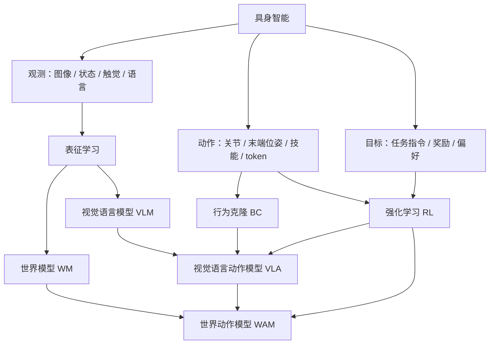
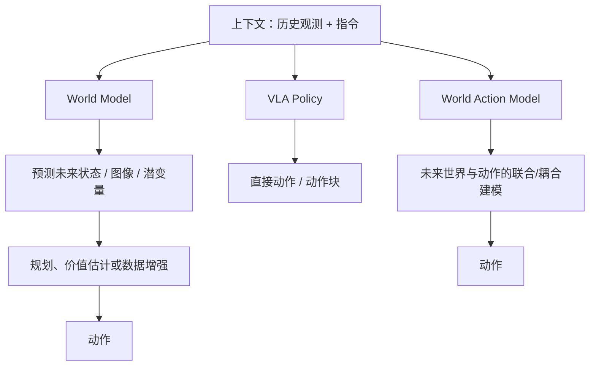
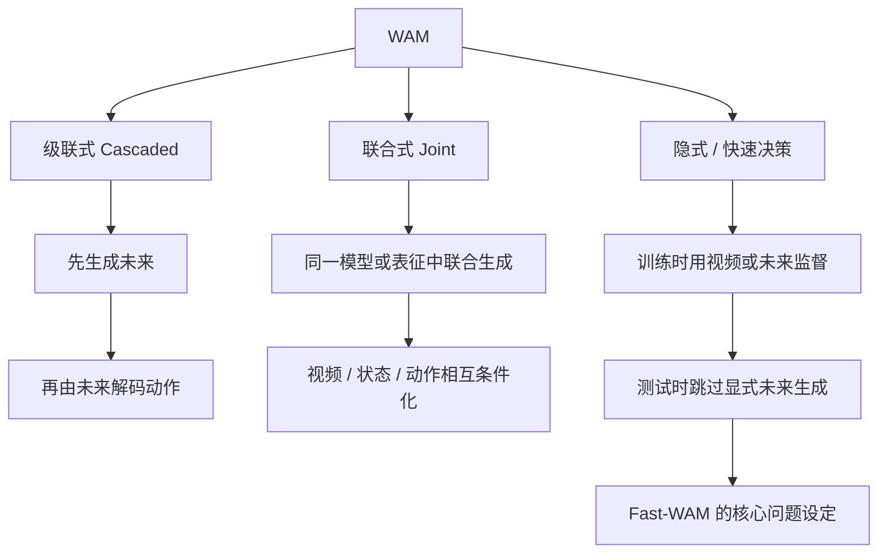
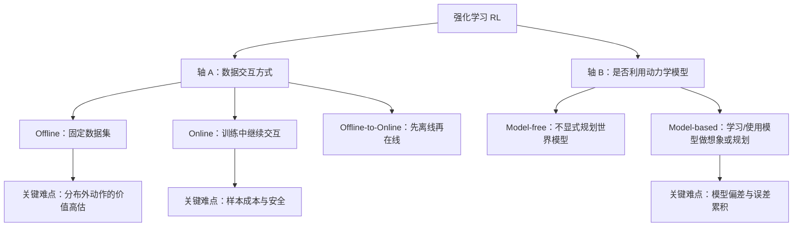
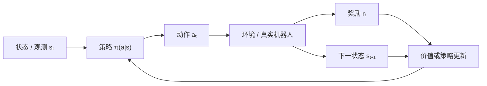
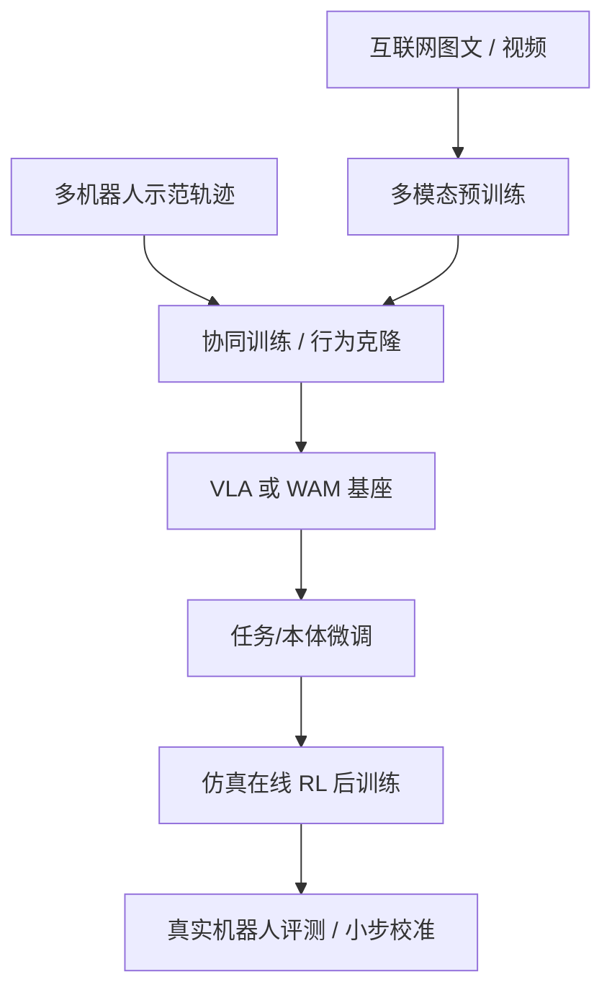

# 知识图谱：WAM、WM 与 RL

这一页不是术语百科，而是一张用于做研究选择的地图。阅读时始终追问：**模型预测什么、动作从哪里来、数据如何获得、部署时是否规划？**

## 1. 具身学习全景

### 核心对象

| 对象 | 典型学习目标 | 决策接口 | 常见优势 | 常见风险 |
| --- | --- | --- | --- | --- |
| VLM | 图文对齐、生成与理解 | 通常不直接输出机器人动作 | 语义知识和泛化强 | 缺少动作与物理接地 |
| VLA | $\pi(a_t \mid o_{\le t}, l)$ | 直接输出动作或动作块 | 端到端、部署路径短 | 容易成为反应式映射；时序/物理建模可能不足 |
| WM | $p(s_{t+1}, r_t \mid s_t, a_t)$ 或其潜空间版本 | 供想象、规划、价值学习或数据生成使用 | 样本效率、反事实预测 | 模型误差累积、OOD 幻觉 |
| WAM | 联合或耦合地预测未来世界与动作 | 未来生成后解码动作，或直接由世界表征出动作 | 将物理预测和策略学习统一 | 训练/推理昂贵，评测标准仍在发展 |

> 这里的公式是常见抽象，不是对所有架构的硬性定义。尤其 WAM 仍是快速演化中的研究范式。

## 2. WM → WAM：差异与连接

### WAM 的常见架构路线

用四个问题读一篇 WAM 论文：

1. **未来表示是什么？** RGB 视频、离散 token、连续潜变量，还是结构化状态？
2. **动作如何进入模型？** 作为条件、与未来交替生成、由逆动力学恢复，还是由独立 action head 预测？
3. **未来预测在哪里使用？** 仅训练期辅助，还是测试期也显式 rollout / search？
4. **闭环价值是否成立？** 视频质量好不等于控制成功；需要看任务成功率、延迟、动作一致性和 OOD 泛化。

## 3. RL：两条正交轴

“offline、online、model-based”不能放在同一层级。正确的分类至少有两条轴。

### 二维矩阵

| | Model-free | Model-based |
| --- | --- | --- |
| **Offline** | BC、CQL、IQL、Decision Transformer | MOPO、MOReL、COMBO、离线 TD-MPC2 |
| **Online** | PPO、SAC、DQN 系列 | Dreamer 系列、MBPO、MuZero、在线 TD-MPC2 |
| **Offline-to-Online** | IQL/CQL 初始化后继续交互，或 VLA 的 RL 后训练 | 离线预训练世界模型，再用在线数据校准并规划 |

补充两点：

- **Decision Transformer** 使用固定轨迹并做条件序列建模，通常归入 offline RL 讨论，但它不一定使用经典 TD 学习。
- **Model-based 不等于显式像素视频生成。** 潜空间动力学、奖励与价值预测也可以构成用于决策的 world model。

## 4. RL 的学习闭环

离线 RL 把“环境 / 真实机器人”换成固定数据集 $D=\{(s,a,r,s')\}$，因此不能随意尝试新动作验证价值估计；这就是分布偏移问题的根源。Model-based RL 则在真实环境之外学习一个近似环境，用于 imagined rollout、MPC 或价值目标。

## 5. VLA / WAM 的常见训练流水线

将 π0.5、StarVLA、RLinf 放进这张图：

- **π0.5**：重点观察异构数据协同训练如何带来开放世界与长时程泛化。
- **StarVLA**：重点观察 VLM backbone 与 action head 的模块化实现。
- **RLinf**：重点观察 VLA 如何连接 rollout、奖励、策略更新与分布式训练。
- **Fast-WAM**：重点观察未来建模在训练期与测试期分别扮演什么角色。

## 6. 做方法比较时的统一坐标

| 维度 | 建议记录 |
| --- | --- |
| 输入 | 单/多视角 RGB、深度、状态、触觉、语言、历史窗口 |
| 动作 | 关节、末端位姿、离散 token、连续动作、action chunk |
| 数据 | 互联网、视频、人类示范、机器人示范、仿真、在线交互 |
| 目标 | BC、flow matching、diffusion、next-token、TD、policy gradient、future prediction |
| 世界表示 | 无、显式像素、离散 token、连续潜空间、结构化 3D |
| 决策 | 一步反应、动作块、MPC、搜索、层级规划 |
| 评测 | 成功率、泛化、样本效率、推理延迟、安全、恢复能力 |

