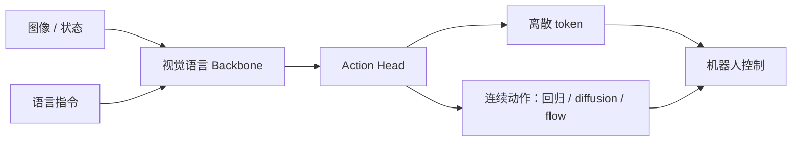

# 论文清单：从基础到 WAM 前沿

## 阅读标记

- **S0｜必读**：建立共同语言，建议精读摘要、方法图、损失函数和实验结论。
- **S1｜主线**：按研究方向选择精读。
- **S2｜扩展**：遇到具体问题时再读。
- 每篇论文建议留下四行笔记：`问题`、`方法`、`关键证据`、`局限/可复现点`。

## S0｜最短主线

| 顺序 | 论文 | 为什么读 | 入口 |
| --- | --- | --- | --- |
| 1 | Reinforcement Learning: An Introduction, 2nd ed. | MDP、价值函数、TD、策略梯度的统一底座 | [Book PDF](https://incompleteideas.net/book/RLbook2020.pdf) |
| 2 | Offline Reinforcement Learning: Tutorial, Review, and Perspectives | 理解固定数据集、分布偏移与保守学习 | [arXiv](https://arxiv.org/abs/2005.01643) |
| 3 | World Models | 理解“压缩表征 + 动力学 + 控制器”的经典范式 | [arXiv](https://arxiv.org/abs/1803.10122) · [Project](https://worldmodels.github.io/) |
| 4 | Diffusion Policy | 机器人动作生成、action chunk 与多峰行为的代表作 | [arXiv](https://arxiv.org/abs/2303.04137) · [Code](https://github.com/real-stanford/diffusion_policy) |
| 5 | π0: A Vision-Language-Action Flow Model for General Robot Control | 理解 VLM backbone、flow matching action expert 与通用策略 | [arXiv](https://arxiv.org/abs/2410.24164) · [Project](https://www.pi.website/blog/pi0) |
| 6 | π0.5: A Vision-Language-Action Model with Open-World Generalization | 异构协同训练、高层语义与开放世界长时程泛化 | [arXiv](https://arxiv.org/abs/2504.16054) · [Project](https://www.pi.website/blog/pi05) · [Code](https://github.com/Physical-Intelligence/openpi) |
| 7 | World Action Models: The Next Frontier in Embodied AI | 用级联式/联合式框架建立 WAM 的系统分类 | [arXiv](https://arxiv.org/abs/2605.12090) · [Resources](https://github.com/OpenMOSS/Awesome-WAM) |
| 8 | Fast-WAM: Do World Action Models Need Test-time Future Imagination? | 区分训练期视频建模收益和测试期显式想象成本 | [arXiv](https://arxiv.org/abs/2603.16666) · [Project](https://yuantianyuan01.github.io/FastWAM/) · [Code](https://github.com/yuantianyuan01/FastWAM) |
| 9 | StarVLA: A Lego-like Codebase for Vision-Language-Action Model Developing | 把 VLA 研究拆为可替换 backbone、action head、训练与部署模块 | [arXiv](https://arxiv.org/abs/2604.05014) · [Code](https://github.com/starVLA/starVLA) |
| 10 | RLinf: Flexible and Efficient Large-scale Reinforcement Learning via Macro-to-Micro Flow Transformation | 理解 VLA/基础模型 RL 后训练的系统问题 | [arXiv](https://arxiv.org/abs/2509.15965) · [Code](https://github.com/RLinf/RLinf) |

## S1｜VLA 与模仿学习

| 论文 | 抓住一个关键点 | 入口 |
| --- | --- | --- |
| RT-1: Robotics Transformer for Real-World Control at Scale | 动作 token 化与多任务真实机器人数据 | [arXiv](https://arxiv.org/abs/2212.06817) |
| RT-2: Vision-Language-Action Models Transfer Web Knowledge to Robotic Control | Web 语义知识如何迁移到机器人动作 | [arXiv](https://arxiv.org/abs/2307.15818) · [Project](https://robotics-transformer2.github.io/) |
| Open X-Embodiment: Robotic Learning Datasets and RT-X Models | 跨本体数据混合与通用策略 | [arXiv](https://arxiv.org/abs/2310.08864) · [Project](https://robotics-transformer-x.github.io/) |
| Octo: An Open-Source Generalist Robot Policy | 开源通用策略、数据混合与轻量适配 | [arXiv](https://arxiv.org/abs/2405.12213) · [Code](https://github.com/octo-models/octo) |
| OpenVLA: An Open-Source Vision-Language-Action Model | 开源 VLA 训练、微调与评测范式 | [arXiv](https://arxiv.org/abs/2406.09246) · [Code](https://github.com/openvla/openvla) |
| Learning Fine-Grained Bimanual Manipulation with Low-Cost Hardware (ACT) | 动作分块与 CVAE 在双臂长序列控制中的作用 | [arXiv](https://arxiv.org/abs/2304.13705) · [Code](https://github.com/tonyzhaozh/act) |
| Diffusion Policy | 以条件去噪建模多峰连续动作分布 | [arXiv](https://arxiv.org/abs/2303.04137) · [Code](https://github.com/real-stanford/diffusion_policy) |
| A Survey on Vision-Language-Action Models for Embodied AI | 从组件、训练目标、任务和架构补齐全景 | [arXiv](https://arxiv.org/abs/2405.14093) |

阅读 VLA 时建议画出这条数据流：

## S1｜World Model 与 Model-based RL

| 论文 | 抓住一个关键点 | 入口 |
| --- | --- | --- |
| World Models | 潜变量世界模型与控制器解耦 | [arXiv](https://arxiv.org/abs/1803.10122) · [Project](https://worldmodels.github.io/) |
| PlaNet: Learning Latent Dynamics for Planning from Pixels | 从像素学习潜空间动力学并做在线规划 | [arXiv](https://arxiv.org/abs/1811.04551) |
| Dream to Control: Learning Behaviors by Latent Imagination | 在潜空间 imagined rollout 上学习 actor-critic | [arXiv](https://arxiv.org/abs/1912.01603) |
| DreamerV3: Mastering Diverse Domains through World Models | 统一超参数、跨域扩展与稳定训练 | [arXiv](https://arxiv.org/abs/2301.04104) · [Code](https://github.com/danijar/dreamerv3) |
| MuZero: Mastering Atari, Go, Chess and Shogi by Planning with a Learned Model | 只学习决策所需的动态、奖励与价值 | [arXiv](https://arxiv.org/abs/1911.08265) |
| MBPO: When to Trust Your Model | 短模型 rollout 如何权衡模型偏差和样本效率 | [arXiv](https://arxiv.org/abs/1906.08253) |
| TD-MPC2: Scalable, Robust World Models for Continuous Control | 隐式潜空间世界模型、价值学习与 MPC 的结合 | [arXiv](https://arxiv.org/abs/2310.16828) · [Project](https://www.tdmpc2.com/) · [Code](https://github.com/nicklashansen/tdmpc2) |
| A Comprehensive Survey on World Models for Embodied AI | 从功能、时间建模和空间表征理解具身 WM | [arXiv](https://arxiv.org/abs/2510.16732) |

## S1｜Offline / Online RL

| 类别 | 论文 | 核心问题 | 入口 |
| --- | --- | --- | --- |
| Online, on-policy | Proximal Policy Optimization Algorithms (PPO) | 如何用 clipped surrogate 稳定策略更新 | [arXiv](https://arxiv.org/abs/1707.06347) |
| Online, off-policy | Soft Actor-Critic (SAC) | 最大熵目标、样本复用与连续控制 | [arXiv](https://arxiv.org/abs/1801.01290) |
| Offline, value-based | Conservative Q-Learning (CQL) | 通过保守 Q 估计抑制 OOD 动作过估计 | [arXiv](https://arxiv.org/abs/2006.04779) |
| Offline, value-based | Implicit Q-Learning (IQL) | 不显式查询数据外动作的价值学习 | [arXiv](https://arxiv.org/abs/2110.06169) |
| Offline, sequence | Decision Transformer | 把控制重写为回报条件序列建模 | [arXiv](https://arxiv.org/abs/2106.01345) · [Code](https://github.com/kzl/decision-transformer) |
| Offline, model-based | MOPO | 用不确定性惩罚模型 rollout 的分布外区域 | [arXiv](https://arxiv.org/abs/2005.13239) |
| Offline, model-based | COMBO | 保守价值学习与模型生成数据结合 | [arXiv](https://arxiv.org/abs/2102.08363) |

### 读 RL 论文的统一模板

1. **设定**：offline / online / hybrid？单任务还是多任务？
2. **模型**：model-free / model-based？若有模型，预测状态、奖励、价值中的哪些量？
3. **目标**：TD、policy gradient、序列建模、行为正则，还是模型预测损失？
4. **数据**：专家、混合质量、探索数据，还是策略实时采样？
5. **风险控制**：保守估计、不确定性、KL/clip、行为约束、安全过滤？
6. **证据**：是否公平控制环境步数、数据量、模型规模、计算量与评测次数？

## S2｜数据、基准与评测

| 论文/项目 | 用途 | 入口 |
| --- | --- | --- |
| D4RL: Datasets for Deep Data-Driven Reinforcement Learning | Offline RL 经典数据与评测协议 | [arXiv](https://arxiv.org/abs/2004.07219) · [Code](https://github.com/Farama-Foundation/D4RL) |
| LIBERO: Benchmarking Knowledge Transfer for Lifelong Robot Learning | 语言条件操作与知识迁移评测 | [arXiv](https://arxiv.org/abs/2306.03310) · [Project](https://libero-project.github.io/main.html) |
| RoboMimic: A Framework for Robot Learning from Demonstration | 示范学习算法与数据质量分析 | [arXiv](https://arxiv.org/abs/2108.03298) · [Project](https://robomimic.github.io/) |
| ManiSkill2 | 大规模操作任务、示范与仿真评测 | [arXiv](https://arxiv.org/abs/2302.04659) · [Code](https://github.com/mani-skill/ManiSkill) |
| Open X-Embodiment | 跨机器人数据规模化与跨本体迁移 | [arXiv](https://arxiv.org/abs/2310.08864) · [Project](https://robotics-transformer-x.github.io/) |

## 建议的阅读产出

不要写长摘要。每篇论文只填下面这张表：

| 字段 | 内容 |
| --- | --- |
| 一句话问题 | 论文试图解决的具体失败模式是什么？ |
| 方法差异 | 相比最强基线，只新增了什么？ |
| 训练信号 | 数据与损失分别是什么？ |
| 推理路径 | 部署时经过哪些模块？是否 rollout / search？ |
| 最强证据 | 哪张表/图最能支持核心主张？ |
| 最大疑问 | 如果复现，最可能失败在哪里？ |
