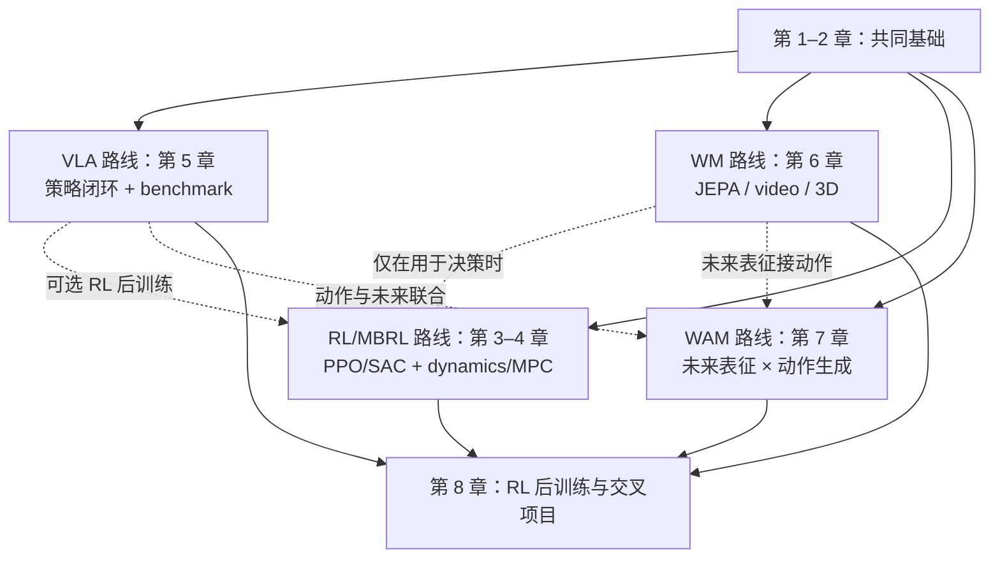

# 具身智能章节式学习路线

章节可以根据研究问题回看、跳读或并行。

## 总览

| 章节    | 主题                                | 路线      |
| ------- | ----------------------------------- | --------- |
| 第 1 章 | MDP、机器人学与控制接口             | 共同基础  |
| 第 2 章 | 模型基础、动作策略与 benchmark 协议 | 共同基础  |
| 第 3 章 | Model-free RL：Online 与 Offline     | RL/MBRL   |
| 第 4 章 | Model-based RL（MBRL）              | RL/MBRL   |
| 第 5 章 | VLM → VLA                          | VLA       |
| 第 6 章 | World Model：JEPA、视频与 3D        | WM        |
| 第 7 章 | WAM 与 Fast-WAM                     | WAM/交叉  |
| 第 8 章 | RL 后训练与综合项目                 | 交叉/可选 |

## 实操路线与依赖

第 1–2 章是共同基础；第 3–7 章按研究问题并行推进：

## 第 1 章｜MDP、机器人学与控制接口

### 项目链接

- [Modern Robotics](https://modernrobotics.northwestern.edu/)：运动学、动力学和控制教材。
- [ModernRobotics](https://github.com/NxRLab/ModernRobotics)：教材配套实现。
- [Pinocchio](https://github.com/stack-of-tasks/pinocchio)：刚体运动学、动力学和自动微分。
- [MuJoCo](https://github.com/google-deepmind/mujoco)：接触动力学仿真。

## 第 2 章｜模型基础、动作策略与 benchmark

### 项目链接

- [模型基础](model-basics.md)：Transformer、diffusion、flow matching 与 DiT。
- [Transformers](https://github.com/huggingface/transformers)：Transformer backbone 与多模态模型接口。
- [Diffusers](https://github.com/huggingface/diffusers)：diffusion、scheduler 和 DiT 工具链。
- [Flow Matching](https://github.com/facebookresearch/flow_matching)：probability path、velocity field 和 ODE 采样。
- [DiT](https://github.com/facebookresearch/DiT)：Transformer diffusion backbone。
- [Diffusion Policy](https://github.com/real-stanford/diffusion_policy)：连续动作 chunk 策略。
- [OpenPI](https://github.com/Physical-Intelligence/openpi)：π0/π0.5 开源实现。

## 第 3 章｜Model-free RL：Online 与 Offline

### 项目链接

- [Gym](https://github.com/openai/gym)：经典 Gym 环境 API（维护状态以仓库说明为准）。
- [Gymnasium](https://github.com/Farama-Foundation/Gymnasium)：统一环境 API。
- [Stable-Baselines3](https://github.com/DLR-RM/stable-baselines3)：PPO、SAC、DQN 等实现。
- [CleanRL](https://github.com/vwxyzjn/cleanrl)：PPO、SAC、DQN 等单文件实现。
- [d3rlpy](https://github.com/takuseno/d3rlpy)：IQL、CQL 等 offline RL 实现与数据接口。
- [Implicit Q-Learning](https://github.com/ikostrikov/implicit_q_learning)：IQL 参考实现。
- [Minari](https://github.com/Farama-Foundation/Minari)：离线轨迹数据 API。

## 第 4 章｜Model-based RL（MBRL）

### 项目链接

- [TD-MPC2](https://github.com/nicklashansen/tdmpc2)：潜空间动力学、价值学习与 MPC。
- [DreamerV3](https://github.com/danijar/dreamerv3)：latent dynamics、imagined rollout 与 actor-critic。
- [World Models](https://worldmodels.github.io/)：latent dynamics + controller 的经典项目。
- [PlaNet](https://github.com/google-research/planet)：潜空间动力学与规划。
- [DMControl](https://github.com/google-deepmind/dm_control)：连续控制与 MBRL 环境。
- [ManiSkill](https://github.com/haosulab/ManiSkill)：GPU 并行操作环境。

## 第 5 章｜从 VLM 到 VLA

### 项目链接

- [OpenVLA](https://github.com/openvla/openvla)：开源 VLA 基线与推理/微调代码。
- [OpenVLA-OFT](https://github.com/moojink/openvla-oft)：OpenVLA 的优化微调与推理实现。
- [OpenPI](https://github.com/Physical-Intelligence/openpi)：π0/π0.5 开源实现。
- [StarVLA](https://github.com/starVLA/starVLA)：模块化 VLA 研究平台。
- [LIBERO](https://github.com/Lifelong-Robot-Learning/LIBERO)：语言条件操作评测。
- [CALVIN](https://github.com/mees/calvin)：长时程语言条件操作评测。

## 第 6 章｜World Model：JEPA、视频与 3D

### 项目链接

- [V-JEPA 2](https://github.com/facebookresearch/vjepa2)：JEPA latent predictive learning。
- [Cosmos Predict2](https://github.com/nvidia-cosmos/cosmos-predict2)：视频世界模型与 physical AI 生成。
- [VGGT](https://github.com/facebookresearch/vggt)：多视图几何与 3D 场景表示。
- [3D Gaussian Splatting](https://github.com/graphdeco-inria/gaussian-splatting)：可渲染 3D 场景表示。

## 第 7 章｜WAM 与 Fast-WAM

### 项目链接

- [FastWAM](https://github.com/yuantianyuan01/FastWAM)：WAM 训练与推理代码。
- [Awesome-WAM](https://github.com/OpenMOSS/Awesome-WAM)：WAM 论文和项目索引。
- [V-JEPA 2](https://github.com/facebookresearch/vjepa2)：未来表征参考实现。
- [Cosmos Predict2](https://github.com/nvidia-cosmos/cosmos-predict2)：视频未来生成参考实现。

## 第 8 章｜RL 后训练与综合项目

### 项目链接

- [RLinf](https://github.com/RLinf/RLinf)：VLA/基础模型 RL 后训练基础设施。
- [StarVLA](https://github.com/starVLA/starVLA)：模块化 VLA 基座。
- [LIBERO](https://github.com/Lifelong-Robot-Learning/LIBERO)、[ManiSkill](https://github.com/haosulab/ManiSkill)、[RoboTwin 2.0](https://github.com/RoboTwin-Platform/RoboTwin)：操作评测环境。
- [bimanual-vla](https://github.com/SUNNYsyy2005/bimanual-vla)：双臂真机部署入口。
