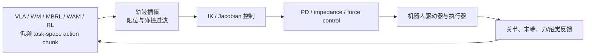

# 机器人学基础：从坐标系到真机闭环

VLA、World Model、MBRL、WAM 和 RL 最终都要落到一个具体机器人上。机器人学负责把视觉/语言/状态转换成**可执行、可约束、可测量**的运动：定义坐标系和状态，计算运动学与动力学，选择控制接口，并在真机上处理标定、延迟和安全边界。

## 1. 最小知识链

| 层级 | 核心对象 | 最小问题 | 与 VLA/WM/WAM/RL 的关系 |
| --- | --- | --- | --- |
| 几何与坐标系 | frame、齐次变换、SE(3) | 这个位姿是在哪个坐标系表达的？ | 统一图像、末端、基座和目标的表示 |
| 正/逆运动学 | $x=f(q)$、$q=f^{-1}(x)$ | 关节状态能否到达目标位姿？ | 将 task-space action 转成关节参考 |
| 微分运动学 | Jacobian $J(q)$ | 末端速度如何映射到关节速度？ | 速度控制、奇异性和可达性检查 |
| 动力学 | $M(q)\ddot q+C(q,\dot q)+g(q)=\tau$ | 需要多大力/力矩，接触会怎样？ | WM 的动作条件预测、MBRL 规划/价值、力控 |
| 轨迹与控制 | interpolation、PD、impedance | 如何平滑、稳定地执行 action chunk？ | 把低频策略输出变成高频控制命令 |
| 感知与标定 | proprioception、camera calibration、hand-eye | 观测和机器人是否在同一几何关系中？ | sim-to-real、视觉伺服、真机复现 |
| 安全与部署 | workspace、limit、collision、E-stop | 失败时如何停住并恢复？ | 真机闭环的硬约束，不由策略自行保证 |

推荐教材与工具：

- [Modern Robotics](https://modernrobotics.northwestern.edu/)：运动学、动力学、轨迹和控制的统一教材与视频。
- [ModernRobotics 仓库](https://github.com/NxRLab/ModernRobotics)：教材配套的 Python/MATLAB 实现。
- [Pinocchio](https://github.com/stack-of-tasks/pinocchio)：刚体运动学、动力学和解析/自动微分接口。
- [ROS 2](https://docs.ros.org/en/rolling/) 与 [MoveIt 2](https://moveit.picknik.ai/main/index.html)：机器人状态、规划、控制器和真机系统集成。

## 2. 坐标系与 SE(3)

用 $T^A_B\in SE(3)$ 表示“坐标系 B 在坐标系 A 中的位姿”：

\[
T^A_B = \begin{bmatrix}R^A_B & p^A_B\\0 & 1\end{bmatrix},\qquad
T^A_C = T^A_B T^B_C.
\]

实践中必须明确：

1. 相机是 eye-in-hand 还是 eye-to-hand；
2. 动作是基座系、末端系还是相机系的 delta；
3. 旋转使用 rotation matrix、axis-angle、quaternion 还是 Euler angle；
4. 左/右手系、单位（m/mm、rad/deg）和时间戳是否一致。

坐标系错误通常表现为“策略看起来有反应，但方向、旋转或抓取位置系统性错误”，不能只靠重新训练解决。

## 3. 运动学与可执行性

给定关节配置 $q$，正运动学得到末端位姿 $x=f(q)$。逆运动学寻找满足

\[
q^*=\arg\min_q\; d\big(f(q),x_{target}\big)
\]

且满足关节限位、碰撞约束和工作空间约束的解。对于速度命令，

\[
\dot x = J(q)\dot q.
\]

部署前至少检查：目标是否可达、IK 是否有连续解、动作 chunk 是否跨越奇异位形、夹爪开合是否与任务阶段同步。VLA 输出 task-space chunk 时，IK、插值和限位过滤应放在策略之外。

## 4. 动力学、轨迹与控制

常见控制层次如下：

- **PD/位置控制**：实现简单，适合自由空间和已有底层伺服器的机器人。
- **阻抗控制**：通过虚拟刚度与阻尼调节接触行为，常写成 $F=K(x_d-x)+D(\dot x_d-\dot x)$。
- **力/扭矩控制**：需要可靠的力矩或末端力传感，适合接触丰富任务，但对标定和安全约束更敏感。
- **轨迹插值**：策略低频输出不能直接当作电机目标；需要在控制频率下插值、限速并处理丢帧。

## 5. 感知、标定与 sim-to-real

真机部署前至少完成：

- 相机内参、畸变和曝光设置；
- 相机到末端/基座的外参与 hand-eye calibration；
- 关节零位、末端工具坐标、夹爪开合范围；
- RGB、proprioception、力/触觉和动作的时间同步；
- 仿真与真机中的尺度、坐标、动作归一化、控制频率和延迟一致性。

对 sim-to-real 实验，单独记录 domain randomization 改变了什么，以及哪些误差由真实硬件引入。

## 6. 与当前仓库主线的衔接

| 研究路线 | 机器人学接口 | 首先验证什么 |
| --- | --- | --- |
| VLA | 视觉/语言/本体状态 → task-space 或 joint action chunk | 坐标、动作单位、IK 可达性和控制频率 |
| WM | 状态/图像/多视角 + action → 未来表征、视频或 3D/4D 场景 | 动作敏感性、表征/视频/几何一致性和长时程漂移 |
| MBRL | 学习动力学/奖励 → imagined rollout、MPC 或价值/策略更新 | 决策回报、样本效率、模型偏差和规划成本 |
| WAM | 未来世界表征 ↔ action chunk | 未来表征是否改善闭环动作，而不只是视频质量 |
| RL | observation、action、reward、termination | reward 是否与真实任务和安全约束一致 |
| 双臂真机 | 两臂状态、相对位姿、同步动作与碰撞约束 | [bimanual-vla](https://github.com/SUNNYsyy2005/bimanual-vla) 的硬件接口、标定和急停流程 |
